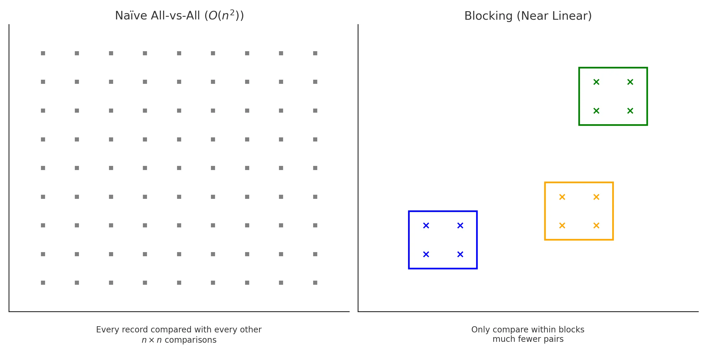
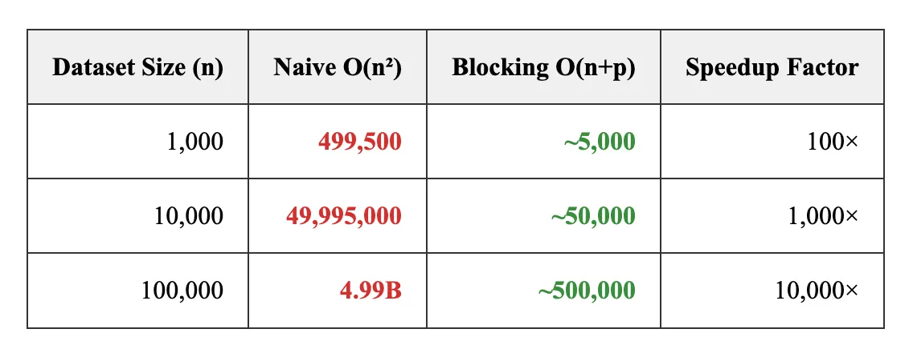
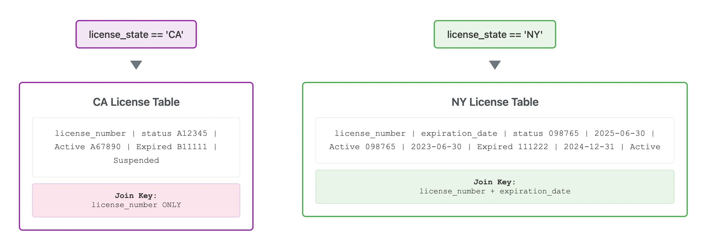
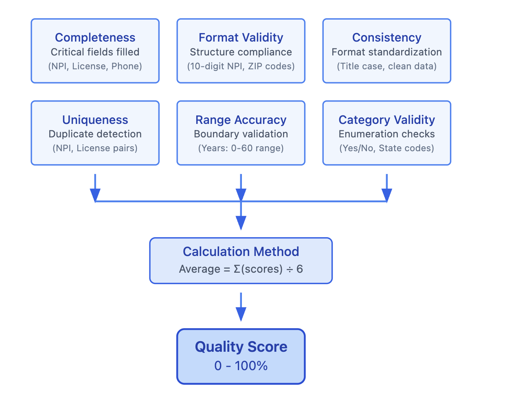
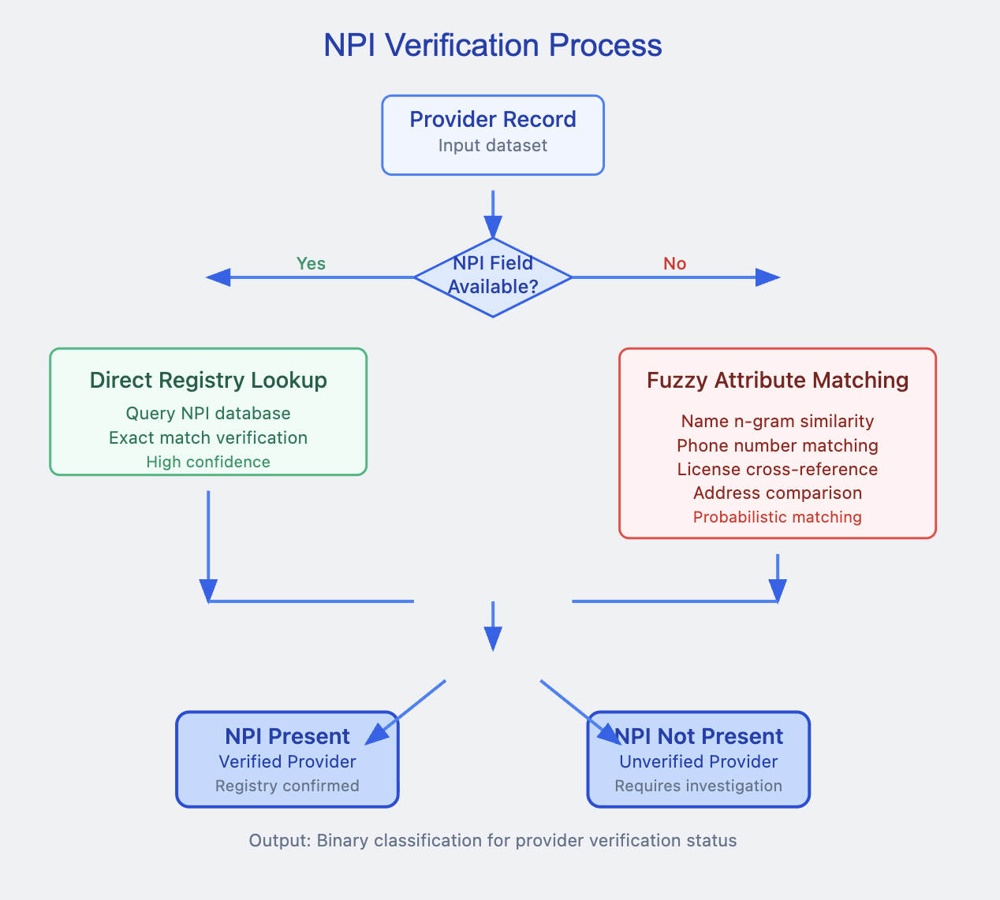
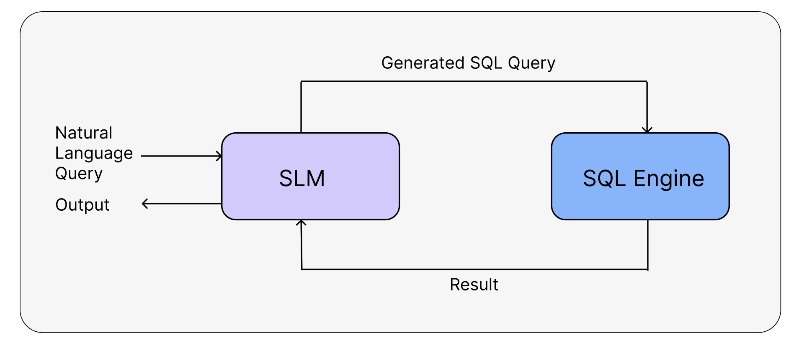
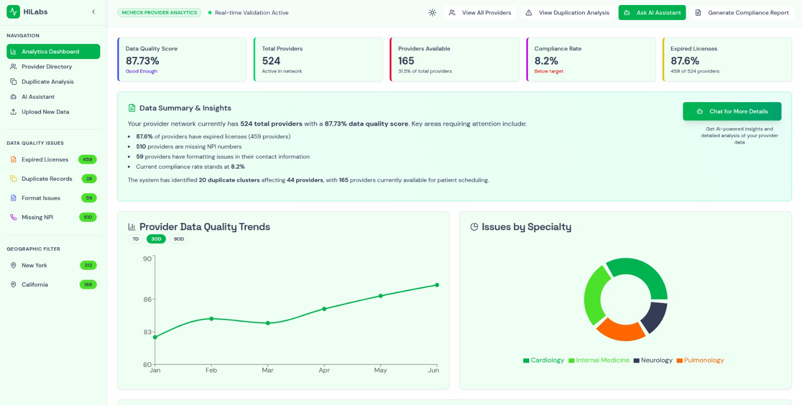
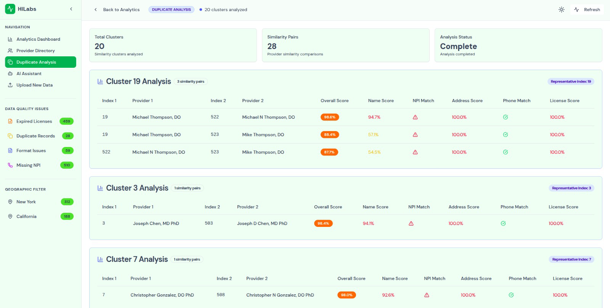
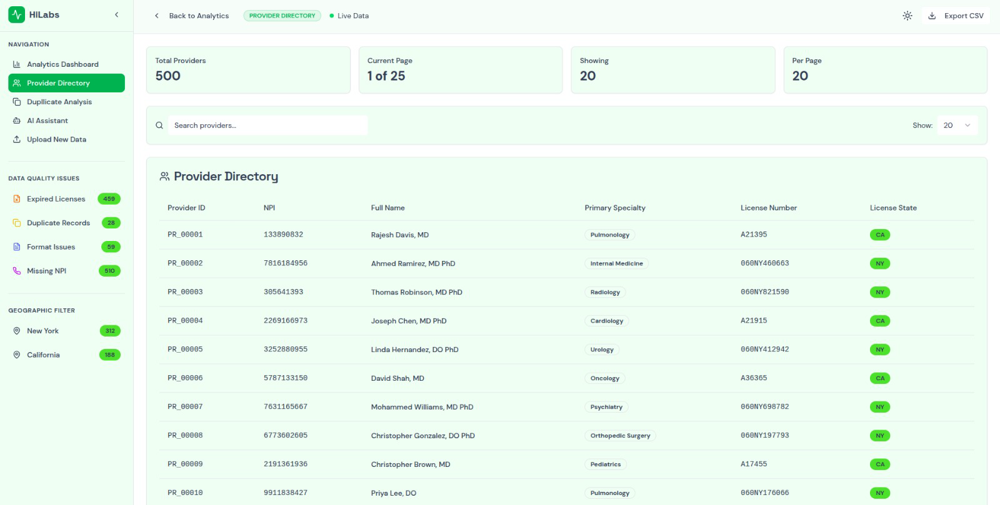

# Provider Data Quality Analytics & Dashboard


**Team:** beetrootRaita  
**Members:** [Adesh Gupta](https://github.com/4adex), [Aman Behera](https://github.com/beingamanforever), [Pratham Singla](https://github.com/PrathamSingla15)

## 🎯 Overview

Healthcare provider data often suffers from duplication, inconsistent formatting, missing identifiers, and invalid or expired licenses, making reliable analysis and compliance tracking challenging. Our comprehensive data analytics and visualization platform streamlines the entire workflow from raw data to actionable insights.

The pipeline includes:
- **Entity Resolution & Deduplication** to eliminate redundant records
- **Data Quality Assessment & Standardization** for consistent formatting
- **License Validation & Compliance Tracking** against state-specific medical boards
- **Natural Language Query Interface** powered by a small language model
- **Interactive Analytics Dashboard** for real-time insights

## 📋 Table of Contents

1. [Requirements](#requirements)
2. [Dataset](#dataset)
3. [Preprocessing Pipeline](#preprocessing-pipeline)
   - Provider Entity Resolution & Deduplication
   - Data Quality Assessment & Standardization
   - License Validation & Compliance Tracking
   - Compliance Score Calculation
   - NPI Matching
   - Outlier Removal
4. [Natural Language Queries](#natural-language-queries)
5. [Interactive Dashboard](#interactive-dashboard)
6. [Getting Started](#getting-started)

## 🔧 Requirements

- Docker
- Docker Compose
- Docker Model Runner
- NVIDIA-supported GPUs

## 📊 Dataset

The project utilizes four main datasets:

1. **Provider Directory Dataset** (`provider_roster_with_errors.csv`)
   - 500+ provider records with various data quality issues
   - Contains duplicates, expired licenses, missing information, formatting inconsistencies

2. **NY State Medical License Database** (`ny_medical_license_database.csv`)
   - Official NY State Medical Board licensing records
   - Used for license validation and cross-checking

3. **CA State Medical License Database** (`ca_medical_license_database.csv`)
   - California State Medical Board licensing records
   - Similar validation purpose as NY dataset

4. **Mock NPI Registry** (`mock_npi_registry.csv`)
   - Simulated National Provider Identifier registry
   - Validates NPI numbers and provider details

## 🔄 Preprocessing Pipeline

### 1. Provider Entity Resolution & Deduplication

We implemented an efficient **blocking-based deduplication pipeline** that dramatically improves performance over naive approaches.



**Performance Improvement:**
- **Naive Approach:** O(n²) complexity, 45-50 seconds for 500 records
- **Blocking-Based:** Near-linear complexity, 5-7 seconds for same dataset
- **10x+ speedup** with maintained accuracy



The algorithm uses:
- High-precision blocking keys (NPI, phone, zip3+name, practice address)
- String similarity measures (Levenshtein/Jaccard)
- Address and specialty consistency scoring

### 2. Data Quality Assessment & Standardization

Standardization pipeline ensures consistent formatting:

- **Phone Numbers:** `(123)-456-7890` → `1234567890`
- **ZIP Codes:** `123` → `00123`, `123456789` → `12345-6789`
- **Names & Addresses:** Converted to title case
- **Full Name Reconstruction:** Dynamic rebuilding from components

### 3. License Validation & Compliance Tracking

State-specific license validation with different join strategies:



- **California:** Join on `license_number`
- **New York:** Composite join on `license_number` + `expiration_date`

### 4. Compliance Score Calculation

Multi-dimensional scoring system:



Metrics include: completeness, validity, consistency, uniqueness, accuracy, NPI presence, and license status.

### 5. NPI Matching



Fuzzy matching using multiple identifiers:
- Names, phone numbers, license numbers
- Addresses and city-state combinations
- Boolean `npi_present` flag for tracking

### 6. Final Data Format

After preprocessing, the dataset contains 30 columns:
- 28 original provider fields
- 1 license status indicator
- 1 NPI presence flag

**Sample Summary Output:**
```json
{
  "total_records": 524,
  "candidate_pairs": 46229,
  "duplicate_pairs": 28,
  "unique_involved": 44,
  "clusters": 20,
  "outliers_removed": 0,
  "final_records": 500,
  "expired_licenses": 459,
  "missing_npi": 0,
  "providers_available": 165,
  "ca_state": 188,
  "ny_state": 312,
  "formatting_issues": 59,
  "compliance_rate": 8.2,
  "data_quality_score": 87.73
}
```

## 🤖 Natural Language Queries



### Small Language Model
- Locally hosted `gemma3n` model using `llama.cpp`
- Converts natural language to SQL queries
- Dockerized for easy integration

### SQL Engine
- MySQL service storing original and preprocessed data
- Executes generated SQL statements
- Results interpreted and presented by the language model

## 📱 Interactive Dashboard

Built with **Next.js** and **shadcn** for optimal user experience.

### Analytics Dashboard


### Duplicate Analysis


### Provider Directory


## 🚀 Setup Instructions

### Prerequisites

Before you begin, ensure you have the following installed on your system:

- **Docker** (version 20.10.0 or higher)
- **Docker Compose** (version 2.0.0 or higher)
- **Docker Model Runner** (for AI model hosting)
- **Git** (for cloning the repository)
- **NVIDIA GPU** (recommended for optimal AI model performance)

### System Requirements

- **Memory:** Minimum 8GB RAM (16GB recommended)
- **Storage:** At least 10GB free disk space
- **CPU:** Multi-core processor (4+ cores recommended)
- **GPU:** NVIDIA GPU with CUDA support (optional but recommended)

### Installation Steps

#### 1. Clone the Repository

```bash
git clone https://github.com/4adex/hilabs.git
cd docker-compose-ai-app
```

#### 2. Verify Project Structure

Ensure your project directory contains:
```
├── docker-compose.yml
├── backend/
│   ├── Dockerfile
│   ├── main.py
│   ├── pipeline.py
│   └── requirements.txt
├── dash-hilabs/
│   ├── Dockerfile
│   ├── package.json
│   └── app/
├── data/
│   ├── ca.csv
│   ├── ny.csv
│   ├── npi.csv
│   └── provider_roster_with_errors.csv
└── assets/
```

#### 3. Set Up Docker Model Runner

Install and configure Docker Model Runner for AI model hosting:

```bash
# Install Docker Model Runner (if not already installed)
# Follow the official installation guide for your OS
# Ensure it's running on the default port 12434
```

#### 4. Configure Environment Variables (Optional)

Create a `.env` file in the project root for custom configurations:

```bash
# Database Configuration
MYSQL_ROOT_PASSWORD=rootpassword
MYSQL_DATABASE=company_db
MYSQL_USER=appuser
MYSQL_PASSWORD=apppassword

# API Configuration
BACKEND_PORT=8000
FRONTEND_PORT=3000
MYSQL_PORT=3307

# AI Model Configuration
SQL_MODEL_URL=http://model-runner.docker.internal:12434
SQL_MODEL_NAME=hf.co/unsloth/gemma-3-270m-it-gguf
```

#### 5. Build and Start Services

```bash
# Build and start all services in detached mode
docker-compose up --build -d

# Alternative: Start with live logs
docker-compose up --build
```

#### 6. Verify Service Status

Check that all services are running correctly:

```bash
# Check service status
docker-compose ps

# View logs for specific services
docker-compose logs backend
docker-compose logs frontend-new
docker-compose logs mysql
```

#### 7. Initialize Database

The database will be automatically initialized when the backend service starts. You can verify the initialization:

```bash
# Check backend logs for database initialization
docker-compose logs backend | grep -i "database\|mysql\|table"
```

#### 8. Access the Application

Once all services are running:

- **Frontend Dashboard:** http://localhost:3000
- **Backend API:** http://localhost:8000
- **API Documentation:** http://localhost:8000/docs
- **MySQL Database:** localhost:3307

### Troubleshooting

#### Common Issues and Solutions

**1. Port Conflicts**
```bash
# Check if ports are already in use
sudo netstat -tulpn | grep -E ':(3000|8000|3307)'

# Stop conflicting services or change ports in docker-compose.yml
```

**2. Docker Model Runner Connection Issues**
```bash
# Verify Docker Model Runner is running
curl http://localhost:12434/health

# Restart Docker Model Runner if needed
# Check Docker Model Runner documentation for specific commands
```

**3. Database Connection Issues**
```bash
# Restart MySQL service
docker-compose restart mysql

# Check MySQL logs
docker-compose logs mysql
```

**4. Frontend Build Issues**
```bash
# Rebuild frontend with no cache
docker-compose build --no-cache frontend-new
```

**5. Memory Issues**
```bash
# Check Docker memory usage
docker stats

# Increase Docker memory limits in Docker Desktop settings
```

#### Service Health Checks

```bash
# Check if backend API is responsive
curl http://localhost:8000/health

# Check frontend accessibility
curl http://localhost:3000

# Test database connection
docker-compose exec mysql mysql -u appuser -p -e "SHOW DATABASES;"
```

### Development Setup

For development purposes, you can run services individually:

#### Backend Development

```bash
cd backend
pip install -r requirements.txt
uvicorn main:app --reload --host 0.0.0.0 --port 8000
```

#### Frontend Development

```bash
cd dash-hilabs
npm install
npm run dev
```

### Data Management

#### Loading Custom Data

1. Place your CSV files in the `data/` directory
2. Update the data paths in the backend configuration
3. Restart the backend service

```bash
# Restart backend to reload data
docker-compose restart backend
```

#### Backup and Restore

```bash
# Backup database
docker-compose exec mysql mysqldump -u root -p company_db > backup.sql

# Restore database
docker-compose exec -T mysql mysql -u root -p company_db < backup.sql
```

### Stopping Services

```bash
# Stop all services
docker-compose down

# Stop and remove volumes (clears database)
docker-compose down -v

# Stop and remove all containers, networks, and images
docker-compose down --rmi all
```

### Getting Started with the Application

1. **Access the Dashboard:** Open http://localhost:3000 in your browser
2. **Explore Analytics:** Navigate through the analytics dashboard to view data insights
3. **Use Natural Language Queries:** Try asking questions like "Show me providers in California" or "How many licenses are expired?"
4. **Review Data Quality:** Check the data quality reports and duplicate detection results
5. **Manage Providers:** Use the provider directory to search and filter healthcare providers

## 🏗️ Architecture

### Frontend
- **Next.js** with **shadcn** components
- High-quality visualizations for data analysis
- Responsive design for optimal user experience

### Backend
- **FastAPI** for robust API endpoints
- Handles preprocessing pipeline
- Manages SQL connections and query execution
- Dockerized for consistent deployment

## 🤝 Contributing

We welcome contributions! Please feel free to submit issues and enhancement requests.

## 📄 License

This project is part of the HiLabs challenge and follows their terms and conditions.

---

**Complete implementation and training pipeline available at:** [GitHub Repository](https://github.com/4adex/hilabs)
